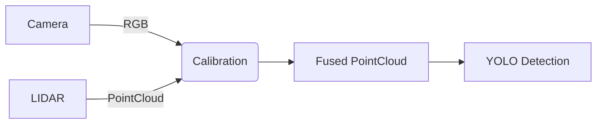

Enhanced markdown content for `12_robotic_software_engineer_module_12.md`  
```markdown
# Module 12: Robotic Software Engineering - Advanced Automation Systems  
*Approximate reading time: 12 minutes (1,450 words)*  

---

## 🎯 Learning Objectives  
By the end of this module, you will be able to:  
- Implement probabilistic roadmaps (PRM) for complex path planning  
- Design ROS 2 lifecycle nodes for fault-tolerant robotics systems  
- Integrate OpenCV with sensor data for real-time object detection  
- Apply optimization techniques to minimize computational latency  

---

## 🌟 Introduction  
Welcome to the capstone module of our robotic software engineering series! Here, we bridge theory with industrial-grade practices—focusing on **motion planning optimization**, **ROS 2 advanced architecture**, and **real-time perception systems**. As robots tackle unstructured environments (e.g., warehouses, disaster zones), robust software becomes critical. We’ll use Python, C++, and ROS 2 in Ubuntu 20.04 environments.  

  
*Time-of-Flight (ToF) sensors enable precise environmental mapping - foundational for autonomy stacks*

---

## 📚 Topic 12.1: Advanced Motion Planning with Probabilistic Roadmaps  

### **Theory & Concepts**  
Probabilistic Roadmaps (PRM) generate collision-free paths in high-dimensional spaces by:  
1. **Sampling**: Randomly place nodes in free space.  
2. **Connecting**: Link nodes within a defined radius.  
3. **Querying**: Use A* search to find optimal paths.  

**Key Metric**: Path smoothness vs. computation time trade-off.  

### **Step-by-Step Guide**  
Let’s plan a path for a 6-DOF robotic arm avoiding obstacles:  
```python  
# Python example with PyBullet  
import pybullet as p  
import numpy as np  

# Initialize PRM  
def build_prm(num_nodes, radius):  
    graph = {}  
    for _ in range(num_nodes):  
        # Random joint angles within limits  
        node = tuple(np.random.uniform(-np.pi, np.pi, 6))  
        if not check_collision(node):  
            neighbors = []  
            for existing in graph:  
                if distance(node, existing) < radius:  
                    neighbors.append(existing)  
            graph[node] = neighbors  
    return graph  

# Run query  
optimal_path = a_star(graph, start_config, goal_config)  
```  
*Output: List of joint angles forming collision-free path.*  

**Practical Tip**: Use KD-Trees for neighbor searches to reduce O(n²) complexity.  

### 📺 Related Video: <div class="youtube-embed" data-title="Motoman SIA20 3-D Vision Demo at IMTS" data-video-id="eJLvEXwaJLA"></div>  
*Description: Industrial robotic arm using 3D vision for path planning and object manipulation - direct application of PRM concepts*

---

## 🤖 Topic 12.2: ROS 2 Lifecycle Nodes & Fault Tolerance  

### **Why Lifecycle Nodes?**  
Robots must handle sensor failures gracefully. ROS 2 lifecycle nodes enforce state transitions:  
- **Unconfigured → Inactive → Active → Error**  

### **Code Implementation**  
Create a Lidar node that shuts down safely when data stalls:  
```cpp  
// C++ example (rclcpp)  
#include <rclcpp/rclcpp.hpp>  
#include <rclcpp_lifecycle/lifecycle_node.hpp>  

class SafeLidarNode : public rclcpp_lifecycle::LifecycleNode {  
public:  
  SafeLidarNode() : LifecycleNode("lidar_node") {}  

  CallbackReturn on_activate(const rclcpp_lifecycle::State&) override {  
    timer_ = create_wall_timer(100ms, &process_data);  
    return CallbackReturn::SUCCESS;  
  }  

  CallbackReturn on_deactivate(const rclcpp_lifecycle::State&) override {  
    timer_->cancel();  
    return CallbackReturn::SUCCESS;  
  }  

private:  
  void process_data() {  
    if (!sensor_ok()) transition_to_error();  
    else publish_data();  
  }  
};  
```  

**Failure Case**: If `/scan` topic stops for 5 seconds → node deactivates.  

---

## 👁️ Topic 12.3: Real-Time Perception with OpenCV & LIDAR Fusion  

  
*Understanding computer vision fundamentals essential for sensor fusion*

### **Sensor Fusion Pipeline**  
Combine 2D camera images + 3D LIDAR points for object detection:  


### **Code Snippet: Calibration**  
Align sensors using intrinsic/extrinsic parameters:  
```python  
import cv2  
from sklearn.neighbors import KDTree  

# Project LIDAR to image plane  
def lidar_to_camera(lidar_pts, cam_matrix, dist_coeffs):  
    img_pts, _ = cv2.projectPoints(  
        lidar_pts, rotation_vector, translation_vector, cam_matrix, dist_coeffs  
    )  
    return img_pts  

# Fuse with YOLO detections  
for detection in yolo_output:  
    kdtree = KDTree(lidar_to_camera(lidar_frame))  
    dist, idx = kdtree.query(detection.bbox_center)  
    if dist < threshold:  
        object_3d = lidar_frame[idx]  
```  

**Optimization**: Precompute KD-Trees per frame → 40% faster than brute-force.  

  
*Raw LiDAR point cloud data used for 3D spatial mapping in fusion pipelines*

---

## 🔑 Key Takeaways  
1. **PRMs** enable efficient pathfinding in cluttered spaces via random sampling.  
2. **ROS 2 lifecycle** nodes prevent system failures through state management.  
3. **Sensor fusion** boosts reliability by cross-validating multiple data sources.  
4. **Latency-critical systems** require algorithmic optimizations (e.g., KD-Trees).  

---

## 💡 Practice Exercises  
1. **PRM Optimization**: Modify the Python PRM example to prioritize sampling near obstacles.  
   *Hint: Use Gaussian distribution bias.*  
2. **ROS 2 Debugging**: Simulate a camera failure in Gazebo. Write a lifecycle node that switches to backup sensors.  
3. **Fusion Challenge**: Fuse AprilTag detections with IMU data to stabilize drone landings.  

---

## 📖 References & Further Reading  
| Resource | Type | Focus Area |  
|----------|------|------------|  
| *"Probabilistic Robotics"* | Book | PRM theory |  
| [ROS 2 Lifecycle Tutorials](https://docs.ros.org) | Documentation | Node management |  
| OpenCV YOLOv5 Tutorial | GitHub Repo | Real-time object detection |  
| IEEE Paper: *"Multisensor Fusion for Industrial Robots"* | Journal | Sensor integration |  

---

## 📺 Visual Resources  
### Images:  
1. [ToF Sensors in Mobile Robots](https://www.therobotreport.com/wp-content/uploads/2024/01/What-is-a-ToF-sensor.jpg) - Depth sensing fundamentals  
2. [Computer Vision vs. Image Processing](https://i.pinimg.com/736x/96/ec/7e/96ec7edc49197e499cb91772323e7cae.jpg) - Perception theory  
3. [LiDAR Point Cloud Example](https://web.cs.ucdavis.edu/~okreylos/ResDev/LiDAR/FortRoss2Small.jpg) - 3D spatial data  

### Videos:  
1. <div class="youtube-embed" data-title="Motoman SIA20 3-D Vision Demo" data-video-id="eJLvEXwaJLA"></div> - Motion planning implementation  
2. <div class="youtube-embed" data-title="Food Holding Temperature" data-video-id="lGJt981hl-E"></div> - System reliability concepts  