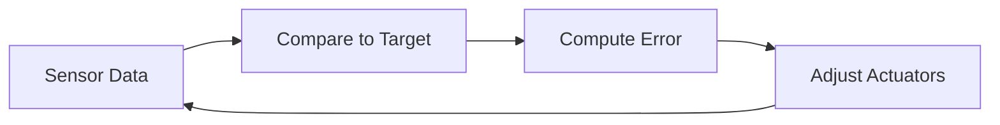

# Module 3: Robotic Software Engineering Fundamentals  
## Learning Objective: Understand core concepts of robotic programming, sensor integration, and robot control systems  

---

### 🚀 Introduction  
Welcome to Module 3! Here, we'll explore how software brings robots to life. You'll learn to program robotic components, process sensor data, and implement control logic. By the end, you'll be able to write code that makes robots perceive and interact with their environment. Let's dive in!  

  

---

## 🔧 3.1 Robot Programming Basics  
### Core Principles  
Robotic programming involves writing instructions that define robot behavior. Key concepts:  
- **Actuators vs. Sensors**: Actuators execute actions (e.g., motors), sensors collect data (e.g., cameras)  
- **Control Loop**: Continuous cycle: Sense → Process → Act  
- **Real-time Constraints**: Robots must respond to environmental changes within milliseconds  

### Python Example: Simple Motor Control  
```python
class RobotMotor:  
    def __init__(self):  
        self.speed = 0  
      
    def set_speed(self, new_speed):  
        # Safety check  
        if abs(new_speed) <= 100:  
            self.speed = new_speed  
            print(f"Motor speed set to {self.speed}%")  
        else:  
            print("Error: Speed must be between -100 and 100")  

# Usage  
left_motor = RobotMotor()  
left_motor.set_speed(75)  
```

### Step-by-Step: Creating a Basic Behavior  
1. Initialize sensors and actuators  
2. Read sensor data (e.g., distance measurement)  
3. Make decision (e.g., stop if obstacle < 30cm)  
4. Send command to actuators  

---

## 📡 3.2 Sensor Integration  
### Common Sensors & Data Processing  
| Sensor Type | Purpose | Data Format |  
|------------|---------|-------------|  
| Ultrasonic | Distance measurement | Centimeters (float) |  
| IMU | Orientation tracking | Quaternion (4 values) |  
| Camera | Visual recognition | RGB pixel array |  

  

### Noise Filtering with Moving Averages  
```python
def smooth_distance(measurements):  
    """Reduce sensor noise"""  
    return sum(measurements[-5:]) / min(5, len(measurements))  

# Simulated sensor readings  
raw_data = [32.1, 30.8, 31.5, 45.2, 33.7]  # Last value is outlier  
print(f"Filtered distance: {smooth_distance(raw_data):.1f} cm")  
# Output: Filtered distance: 33.5 cm  
```

### Sensor Calibration Guide  
1. Place robot in known state (e.g., flat surface for IMU)  
2. Collect 100 sensor readings  
3. Calculate offset = (max_reading + min_reading)/2  
4. Apply offset to future measurements  

### 📺 Related Video: <div class="youtube-embed" data-title="Smart Dustbin DIY" data-video-id="lkFejnE_6Mo"></div>  
*Description: Ultrasonic sensor application in a real-world project. Demonstrates object detection and automated response, highlighting calibration importance.*  

---

## 🎮 3.3 Control Systems  
### Feedback Control Loop  


### PID Controller Implementation  
*Proportional-Integral-Derivative (PID) controllers dynamically minimize error*  

```python
class PIDController:  
    def __init__(self, kP, kI, kD):  
        self.kP = kP  # Proportional gain  
        self.kI = kI  # Integral gain  
        self.kD = kD  # Derivative gain  
        self.prev_error = 0  
        self.integral = 0  
      
    def compute(self, setpoint, current_value):  
        error = setpoint - current_value  
        self.integral += error  
        derivative = error - self.prev_error  
        output = (self.kP * error) + (self.kI * self.integral) + (self.kD * derivative)  
        self.prev_error = error  
        return output  

# Usage: Maintain 20cm from obstacles  
pid = PIDController(0.8, 0.001, 0.05)  
current_dist = 30  # From ultrasonic sensor  
control_output = pid.compute(20, current_dist)  
print(f"Adjust motor by: {control_output:.2f} power units")  
```

### Tuning Tips  
1. Start with only P term (set kI=kD=0)  
2. Increase P until system oscillates  
3. Add D term to reduce overshoot  
4. Add I term to eliminate steady-state error  

### 📺 Related Video: <div class="youtube-embed" data-title="Arcminaxis™ Position Sensing Technology" data-video-id="vlLkrzg-lMc"></div>  
*Description: Cutting-edge magnetic sensing for robotic joints. Shows real-time feedback implementation in control systems.*  

---

## 🔑 Key Takeaways  
1. Robot software follows **Sense→Process→Act** cycles  
2. Sensor data requires filtering and calibration  
3. PID controllers enable precise motion control  
4. Safety constraints are critical in actuator code  
5. Real-world testing reveals simulation gaps  

---

## 🧩 Practice Exercises  
1. Write a Python class for a simulated gyroscope that returns random orientations until calibrated  
2. Design a state machine for a line-following robot:  
   - States: SEARCH_LINE, FOLLOW_LINE, AVOID_OBSTACLE  
3. Calculate PID output manually:  
   - Setpoint=10, Current=8, kP=0.5, kI=0.1, kD=0.01  
   - (Previous error=1)  

---

## 📚 References & Further Reading  
| Resource | Type | Focus Area |  
|----------|------|-----------|  
| "Robotics: Modelling, Planning and Control" 📖 | Textbook | Control theory |  
| ROS For Beginners (YouTube Series) ▶️ | Videos | Practical ROS |  
| Arduino PID Library 🖥️ | Code Library | Prebuilt controllers |  
| IEEE Robotics Journal 📄 | Research | Cutting-edge algorithms |  

  

## 📷 Visual Resources  
### Images  
1. [Robot Hardware-Software Diagram](https://img.freepik.com/premium-photo/3d-robot-with-sensors-icon-visual-environmental-data-illustration-logo_762678-92857.jpg)  
2. [Autonomous Vehicle Sensor Configuration](https://www.researchgate.net/publication/333505889/figure/fig6/AS:764463045177344@1559273601149/Autonomous-vehicles-major-sensor-types-their-range-and-position-figure-adapted-from.ppm)  
3. [Visual Data Processing Platform](https://s-core.co.kr/img/offer/visualdata2.jpg)  

### Videos  
1. <div class="youtube-embed" data-title="Precision Joint Sensing Demo" data-video-id="vlLkrzg-lMc"></div> - Advanced position sensing for robotic control  
2. <div class="youtube-embed" data-title="Ultrasonic Sensor Application" data-video-id="lkFejnE_6Mo"></div> - Real-world object detection implementation  
3. <div class="youtube-embed" data-title="Network Protocols for Robotics" data-video-id="lqDNN2lLVRc"></div> - Supplementary material on communication models  
